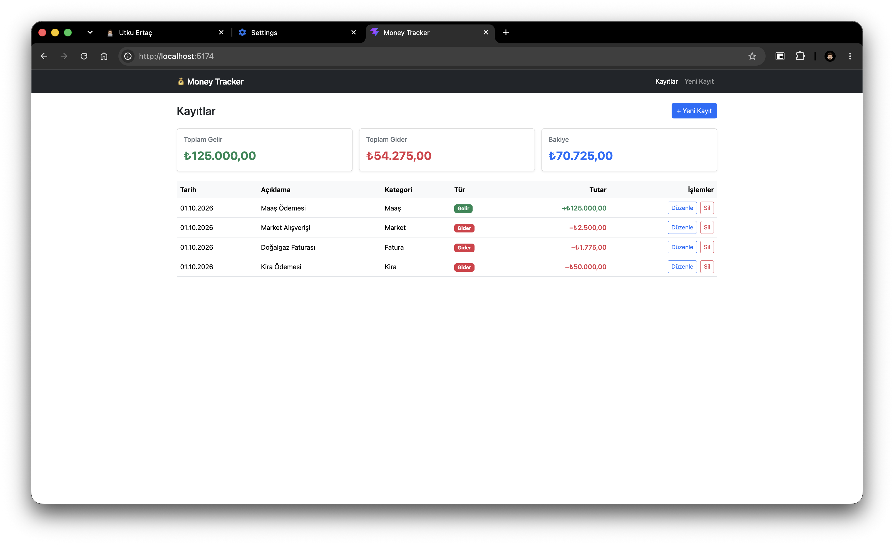

# 💰 Money Tracker

Gelir ve giderlerini kaydedip bakiyeni takip edebileceğin bir harcama takip uygulaması. React ve Bootstrap 5 ile geliştirildi, veriler tarayıcının LocalStorage alanında saklanır.

**Canlı demo:** [money-tracker-utkuertac.vercel.app](https://money-tracker-utkuertac.vercel.app)



## Özellikler

- **Ekleme:** Gelir veya gider kaydı ekleme (açıklama, tutar, kategori, tarih)
- **Listeleme:** Tüm kayıtları tarihe göre yeniden eskiye listeleme
- **Güncelleme:** Mevcut bir kaydı düzenleme
- **Silme:** Onay penceresiyle kayıt silme
- **Özet:** Toplam gelir, toplam gider ve bakiye kartları
- **Form doğrulama:** Boş açıklama ve geçersiz tutar engellenir
- **Kalıcı veri:** Kayıtlar LocalStorage'da tutulur, sayfa yenilense de kaybolmaz
- **Duyarlı tasarım:** Mobil ve masaüstünde düzgün görünür

## Kullanılan Teknolojiler

| Teknoloji | Kullanım amacı |
|---|---|
| [React 19](https://react.dev) | Arayüz kütüphanesi |
| [Vite](https://vite.dev) | Geliştirme sunucusu ve derleme aracı |
| [React Router](https://reactrouter.com) | Sayfalar arası geçiş |
| [Bootstrap 5](https://getbootstrap.com) | Stil ve hazır bileşenler |
| LocalStorage | Verilerin tarayıcıda saklanması |
| [Vercel](https://vercel.com) | Yayınlama |

## Kurulum

Bilgisayarında [Node.js](https://nodejs.org) (20 veya üzeri) kurulu olmalı.

```bash
git clone https://github.com/utkuertac/money-tracker.git
cd money-tracker
npm install
npm run dev
```

Uygulama `http://localhost:5173` adresinde açılır.

## Komutlar

| Komut | Açıklama |
|---|---|
| `npm run dev` | Geliştirme sunucusunu başlatır |
| `npm run build` | Yayın için `dist/` klasörüne derler |
| `npm run preview` | Derlenmiş sürümü yerelde açar |
| `npm run lint` | Kod denetimi yapar |

## Sayfalar

| Adres | Sayfa |
|---|---|
| `/` | Kayıt listesi ve bakiye özeti |
| `/ekle` | Yeni kayıt ekleme formu |
| `/duzenle/:id` | Kayıt düzenleme formu |
| diğer | 404 sayfası |

## Veri Modeli

Her kayıt LocalStorage'da `money-tracker:transactions` anahtarı altında şu yapıda saklanır:

```js
{
  id: "4286f3a5-a3b6-45c5-ad08-18eb728f14f4", // benzersiz kimlik
  type: "expense",                            // "income" (gelir) veya "expense" (gider)
  description: "Market alışverişi",
  amount: 2500,                               // TL, her zaman pozitif
  category: "Market",
  date: "2026-10-01"                          // YYYY-AA-GG
}
```

**Kategoriler**
- Gelir: Maaş, Ek Gelir, Yatırım, Hediye, Diğer
- Gider: Market, Fatura, Kira, Ulaşım, Yeme-İçme, Sağlık, Eğlence, Alışveriş, Diğer

## Proje Yapısı

```
money-tracker/
├── public/                     # Favicon
├── docs/screenshots/           # README görselleri
├── src/
│   ├── Components/             # Tekrar kullanılabilir bileşenler
│   │   ├── Layout.jsx          #   Menü + sayfa iskeleti
│   │   ├── Navbar.jsx          #   Üst menü
│   │   ├── SummaryCards.jsx    #   Gelir / gider / bakiye kartları
│   │   ├── TransactionList.jsx #   Kayıt tablosu
│   │   ├── TransactionForm.jsx #   Ekleme ve düzenleme formu
│   │   └── ConfirmModal.jsx    #   Silme onay penceresi
│   ├── Pages/                  # Sayfalar
│   │   ├── HomePage.jsx
│   │   ├── AddTransactionPage.jsx
│   │   ├── EditTransactionPage.jsx
│   │   └── NotFoundPage.jsx
│   ├── Interfaces/             # Veri modeli ve sabitler
│   │   └── Transaction.js
│   ├── Services/               # LocalStorage işlemleri (CRUD)
│   │   └── transactionService.js
│   ├── Utils/                  # Para ve tarih biçimlendirme
│   │   └── format.js
│   ├── App.jsx                 # Route tanımları
│   └── main.jsx                # Giriş noktası
├── index.html
├── vercel.json                 # Vercel yönlendirme ayarı
└── package.json
```

## Yayınlama

Proje [Vercel](https://vercel.com) üzerinde yayınlanır. GitHub reposuna her push yapıldığında Vercel siteyi otomatik olarak yeniden derler. `vercel.json` dosyası, `/duzenle/...` gibi alt sayfalarda sayfa yenilendiğinde 404 hatası alınmaması için tüm istekleri `index.html`'e yönlendirir.
